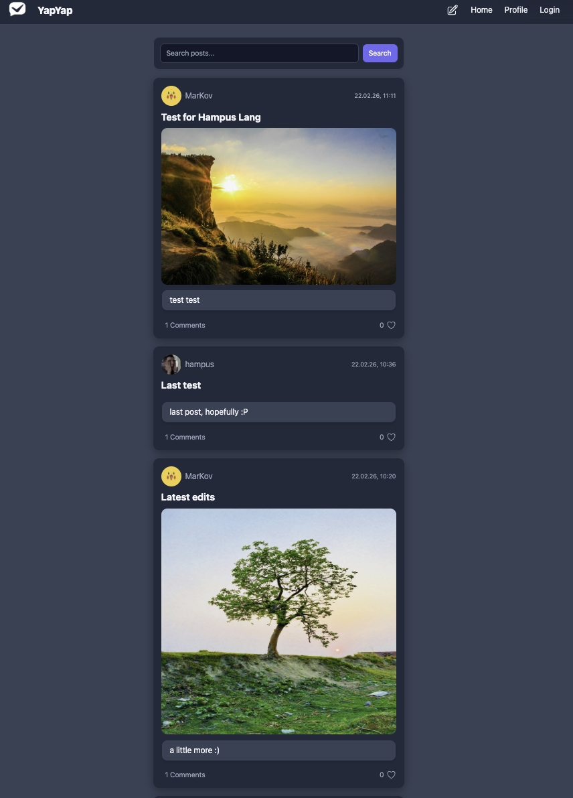

# Social Media App

A front-end social media application built as part of the Noroff Front-End Development program.  
The application allows users to create, edit and delete posts, follow other users, and interact with content using the Noroff Social API.


## Live Demo

https://AlexanderLislelid.github.io/social-media-app/


## Preview



---

## Features

- Register and login
- Create posts
- Edit posts
- Delete posts
- View posts from other users
- Follow / Unfollow users
- Profile page
- Pagination and search
- View user profiles


## Tech Stack


## Project Structure
```text
src/
│
├── api/
│ └── apiClient.js
│
├── components/
│ ├── Button.js
│ └── PostCard.js
│
├── views/
│ ├── HomeView.js
│ ├── LoginView.js
│ ├── RegisterView.js
│ ├── ProfileView.js
│ ├── CreatePostView.js
│ ├── PostModalView.js
│ ├── UserView.js
│ └── NotFoundView.js
│
├── utils/
│ ├── storage.js
│ ├── validation.js
│ └── icons.js
│
├── assets/
│ └── logo files
│
├── router.js
└── main.js
```
---

## Installation


Clone the repository:
```
git clone https://github.com/AlexanderLislelid/social-media-app.git
```
Install dependencies:
```
npm install
```
Run development server:
```
npm run dev
```
---

## Author

Alexander Lislelid  
Front-End Development Student
